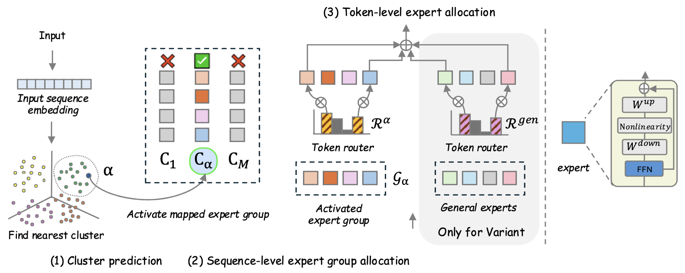

# Mixture-of-Clustered-Experts: Advancing Expert Specialization and Generalization in Instruction Tuning



This repository provides an implementation of Mixture-of-Clustered-Experts (MoCE), a MoE extension featuring a dual-stage routing mechanism that combines sequence-level clustering with token-level activation to enhance expert specialization and generalization capability.

### Repository Structure
```
Camelidae/
├── configuration_camelidae.py      # Global configuration
├── modeling_camelidae.py           # Core MoCE model
├── modeling_camelidae_variant1_add_features.py
│                                   # MoCE variant
├── data/
│   ├── data_download.py             # Dataset download
│   ├── get_embedding_ensemble.py    # Embedding generation
│   └── load_and_kmeans_cluser_k.py  # K-means clustering
├── train_scripts/
│   └── train_moce.sh                # Training launcher
├── train_moce.py                    # Main training entry
├── train_moce_variants.py           # Variant experiments
├── merge_moe_lora.py                # Merge MoE + adapter weights
├── transformers_utils.py            # HF utilities
├── utils.py                         # Shared helpers
├── requirements.txt
└── README.md

```

### Installation
```
pip install -r requirements.txt
```

### Data & Clustering
- Cluster assignments are used for MoCE sequence-level routing
- The workflow begins with data downloading, followed by full dataset embedding and K-means clustering. For computational efficiency, embeddings and cluster predictions are pre-computed prior to training.
```
python data/data_download.py
python data/get_embedding_ensemble.py --model ${instructor,e5}
python data/load_and_kmeans_cluser_k.py --model ${instructor,e5} --k ${num_cluster}
```

### Training
```
bash train_scripts/train_moce.sh
```

### Merge MoE + Adapter weight
```
python merge_moe_lora.py --save ${new_model_name} --path ${saved_checkpoint_path} --num_cluster ${num_cluster} --topk ${top-k routing}
```

## Citation
```bibtex
@inproceedings{eo2025mixture,
  title={MIXTURE-OF-CLUSTERED-EXPERTS: Advancing Expert Specialization and Generalization in Instruction Tuning},
  author={Eo, Sugyeong and Lee, Jung Jun and Park, Chanjun and Lim, Heui-Seok},
  booktitle={Proceedings of the 2025 Conference on Empirical Methods in Natural Language Processing},
  pages={14212--14223},
  year={2025}
}
```

### Acknowledgments
Our codebase leverages parts of the [Parameter-Efficient-MoE](https://github.com/wuhy68/Parameter-Efficient-MoE) repository. We are grateful to the authors for providing a robust starting point for our research in MoCE.

## License
The source code in this repo is licensed under the [Apache 2.0 License](https://github.com/sugyeonge/MoCE/blob/master/LICENSE).
